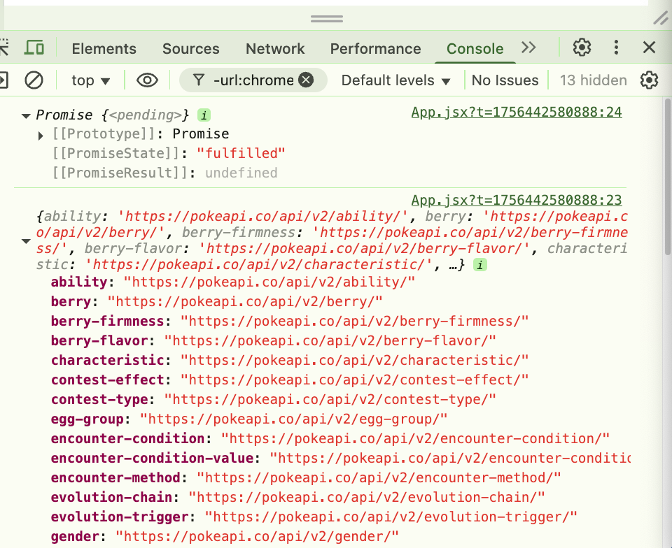

# 포켓몬 도감 만들기 미니프로젝트

## 📖 포켓몬 도감 (Pokédex)

리액트와 최신 프론트엔드 기술 스택을 활용하여 제작한 포켓몬 도감 애플리케이션입니다.
포켓몬의 이름, 이미지, 설명을 불러오고 검색 및 찜 기능을 제공합니다.

---

## 1. 포켓몬 기본 정보 가져오기 (이름, 이미지, 설명)

### 1-1. 포켓몬 객체 구조 정의

```
id : 포켓 아이디
name : 포켓몬 이름
description : 설명
front : 포켓몬 정면 사진
back : 포켓몬 후면 사진


```

```jsx
//api비동기 처리
useEffect(() => {
  const api = fetch("https://pokeapi.co/api/v2")
    .then((res) => res.json())
    .then((data) => console.log(data));
  console.log(api);
}, []);
```

### 1-2. API 연동 확인



- `fetch` 함수를 통해, `API` 연결 확인하는 작업 진행하였다.
- 정상적으로 `Promise` 객체가 `Pending` 된 걸 확인할 수 있다.
- 이제 , 이 과정을 통해 포켓몬의 이름 + 사진 + 설명을 연결 시켜서 데이터를 받아와야 한다.
- 그러기 위해선, 앤드포인트와 객체의 속성명을 어떤걸로 접근하는지 파악이 필요하다.

### 1-3. 포켓몬 이름 불러오기

```jsx
"https://pokeapi.co/api/v2/pokemon-species/4/";
//포켓몬 타입종류(물타입,몬스터,등등)
```

포켓몬의 위 URL은 포켓몬의 종류들 모두 파악할 수 있는 곳!

이름은 위 과정으로 들어가서, "`name`" 으로 접근해야한다.

비동기에서 전달받은 객체인 data의 names로 접근하면 11개요소를 가진 배열1개를 받아온다.

배열에서 `find` 함수를 사용하여, 언어가 ko 에서 `name` 프로퍼티를 찾아야함


### 1-4. 포켓몬 이름 언어별 필터링

```jsx
fetch("https://pokeapi.co/api/v2/pokemon-species/4/")
  .then((res) => res.json())
  .then((data) =>
    console.log(data.names.find((el) => el.language.name === "ko").name),
  );
```

- 이걸 활용해서, "포켓몬 이름"이 나오는 객체를 만들자 !
- 이거와 마찬가지로, 포켓몬의 설명 + 포켓몬 이미지 파일 긁어오면 된다!

### 1-5. 포켓몬 이미지 불러오기

```jsx
파이리 앞면 사진 : "https://raw.githubusercontent.com/PokeAPI/sprites/master/sprites/pokemon/4.png"
//확장자 앞이 포켓몬의 id값이다
파이리 뒷면 사진 : "https://raw.githubusercontent.com/PokeAPI/sprites/master/sprites/pokemon/back/4.png"
```

---

## 2. 전체 포켓몬 도감 구성 (1~151)

### 2-1. 도감 배열 목표

위에서 만든 배열에 이제 각 포켓몬의 정보를 id 값에 맞게끔 정보를 담아주면 된다.
예시는 아래와 같다! 우리는 아래처럼 만들어주는 작업을 해야한다!

```jsx
[
  {
    id: 4,
    name: "파이리",
    description:
      "꼬리의 불꽃은 파이리의\n생명력의 상징이다.\n건강할 때 왕성하게 불타오른다.",
    front:
      "https://raw.githubusercontent.com/PokeAPI/sprites/master/sprites/pokemon/4.png",
    back: "https://raw.githubusercontent.com/PokeAPI/sprites/master/sprites/pokemon/back/4.png",
  },
  {
    id: 5,
    name: "꼬부기",
    description:
      "꼬리의 불꽃은 꼬부기의\n생명력의 상징이다.\n건강할 때 왕성하게 불타오른다.",
    front:
      "https://raw.githubusercontent.com/PokeAPI/sprites/master/sprites/pokemon/5.png",
    back: "https://raw.githubusercontent.com/PokeAPI/sprites/master/sprites/pokemon/back/5.png",
  },
];
```

우리는 포켓몬의 정보를 객체로 담고, `배열로` 만들어줘야한다.

1번 배열은 파이리 정보 , 2번 배열은 꼬부기의 정보 처럼 말이다.

이럴때, 151개의 배열을 어떻게 만들 것 인가?

빈배열 사용해서 사용하게 해주는 자바스크립트의 메서드인 `Array.from ` 으로 객체를 배열로 만들어 사용하면 된다.

해당 메서드를 사용하게 되면, 151개의 배열이 생기게 되는데 아래 코드 처럼 구현해서 한번 콘솔에 찍어보자. !

---

### 2-2. Array.from으로 도감 틀 생성

```jsx
Array.from({ length: 151 }, (_, idx) => {});
Array.from({ length: 151 }, (_, idx) => {
  idx + 1;
});
//[1, 2, 3, 4, 5, 6, 7, 8, 9, 10, 11, 12, 13, 14, 15, 16, 17, 18, 19, 20, 21, 22, 23, 24, 25, 26, 27, 28, 29, 30, 31, 32, 33, 34, 35, 36, 37, 38, 39, 40, 41, 42, 43, 44, 45, 46, 47, 48, 49, 50, 51, 52, 53, 54, 55, 56, 57, 58, 59, 60, 61, 62, 63, 64, 65, 66, 67, 68, 69, 70, 71, 72, 73, 74, 75, 76, 77, 78, 79, 80, 81, 82, 83, 84, 85, 86, 87, 88, 89, 90, 91, 92, 93, 94, 95, 96, 97, 98, 99, 100, …]
```

1. 배열의 갯수
2. 콜백함수 (151개가 뭐로 구성이 되어있는데 ? 배열의 어떤 내용물 넣을 건지 설정함 )
   - 여기에서 숫자로 1.2.3....151 을 넣을 것이다.

### 2-3. 포켓몬 데이터 요청 (map 사용)

```jsx
const pokemonDatas = arrayNum.map((id) => getPokemonData(id));
console.log(pokemonDatas);
//콘솔값
//(151) [Promise, Promise, Promise, Promise, Promise, Promise, Promise, Promise, Promise, Promise, Promise,...]
```

- `getPokemonData(id)` 각 배열에서 생성하게 된 숫자값 = 포켓몬의 아이디값 에서 넘어온 포켓몬 정보들은 `Promise타입이다`.
- `arrayNum` 은 [1,2,3,.....,151] -> 이 숫자값을 `Promise객체` 로 교체해야하기 위해 `map()` 함수를 사용함.

---

### 2-4. Promise.all로 데이터 수집

```jsx
Promise.all(pokemonDatas).then((pokemons) => {
  console.log(pokemons);
});
```

1. Promise.all 에서 배열을 받게 된다면, 모든 Promise 가 `fullfielld` 될 때 까지 기다립니다.
2. 각 `Promise` 의 최종 결과값 (json으로 변환된 객체들)로 변환해준다.

---

## 3. 비동기 처리 RTK - asyncThunk
### 3-1. createAsyncThunk 로 비동기 처리 
### 3-2. pokemonSlice만들기
